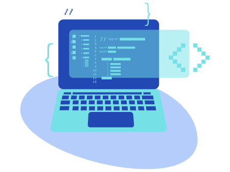

# Basic Training

### Table of Contents

**[Introduction](#Introduction)** 
**[Purpose](#Purpose)** 
**[Fundamentals](#Fundamentals)** 
**[What's in it for me?](#What's-in-it-for-me?)** 
**[Installation Instructions](#Introduction)** 
**[Installation Instructions](#Introduction)** 

- [Course Outline](##Course-Outline)
- [Contributing](##Additions-and-Contributions)

## Introduction

First, please give this repo a star ⭐️!

If you are interested in Ethereum development, be sure to have a look at our DevPortal and other course offerings.

- [dev portal](https://consensys.net/developers/)
- [course offerings](https://consensys.net/academy/)

### Purpose

This course aims to teach software developers the best practices for using fundamental software development tools.

It is aimed at new learners and intermediate software engineers. This course is helpful for general software engineering and for those wishing to enter blockchain development.

This is to help showcase the tools a developer has at their fingertips and show you some tips and tricks along the way.

### Fundamentals

It's the little things that count. In a professional software developer's life, these tools are like air: ever-present, all-encompassing, and direly needed. To be at our best, we need to learn how to utilize these properly.

Too often, we are taught what is "good enough" to accomplish the job, but not necessarily the best practices. This results in compounding bad practices, resulting in wasted time and unnecessary agony.

We built this mini-course to give a place to learn these fundamental tools in a deliberate, focused way. This came from our experience of seeing many people signing up for our [Blockchain Frontend Bootcamp](https://consensys.net/academy/bootcamp/) and having to learn the fundamentals, frontend development, and blockchain skills.

Learning these tools is similar to learning how to breathe properly. It seems foolish at first. But if done properly, it's the key to a meditative rest that allows you to get into the zone. Or at least not deal with an unnecessary disturbance in your everyday workflow.

We hope to pre-emptively help with many of the issues we've seen people struggle with over the years.

## What's in it for me?

If you're staring at a code editor for hours, shouldn't it be tricked out in the best way possible? What you learn here could make your developer experience not only more efficient but fun!

Even if you're very familiar with the technology in these lessons, we encourage you to flip through them. Along with introductory material, we've curated tips and tricks for optimizing and improving your use of these tools.

We want to help ensure you have not only the tools, but the fundamental knowledge on how to make them work for you as you develop your preferences.

## Course Outline

In this mini-course, we will go through:

- Unix / Linux Operating Systems 

- Command Line 
- Code Editor 
- Git 
- Javascript / Node / Web Frameworks 

We will provide some material in these lessons, but we'll mainly provide links to other places where you can learn more.

If you never left the mini-course, after completing it, you'll be able to find your way around a computer pretty well. However, please follow the links within a lesson to dive deeper, deepen your knowledge, and enhance your developer experience.

Now, let's take a deep breath, relax, and learn the way.

## Additions and Contributions

This course will grow over time. Contributions are HIGHLY encouraged and desired. If you see an error, please open an issue and submit a pull request.

We envision this course to grow over time—sections on "contributing to open source" would be helpful. Should you have an idea, please open an issue and discuss it with the team. Pull requests are highly appreciated.

Please see [CONTRIBUTING.md](./CONTRIBUTING.md) for how to make a contribution.

An example of this process found below:
Found in the top right of the repository information 

1. Fork it (<https://github.com/ConsenSys-Academy/basic-training>)
2. Create your feature branch (`git checkout -b branchName`)
3. Commit your changes (`git commit -m 'Added X input'`)
4. Push to the branch (`git push origin branchName`)
5. Create a new Pull Request

Made with ♥️ by [ConsenSys](https://consensys.net/).
